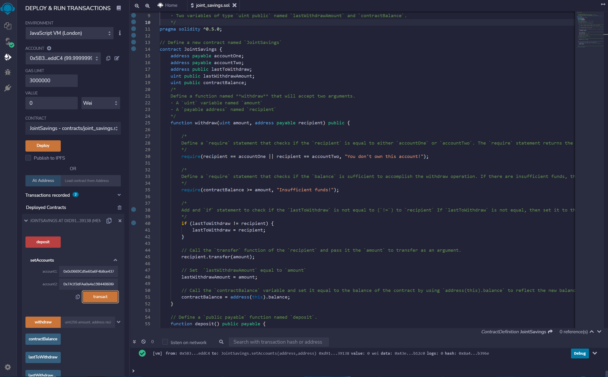
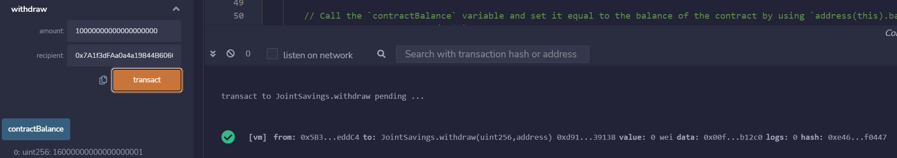

# Savings-Smart-Contract
Joint savings account Solidity smart contract using Remix IDE

## Overview ##
Created a Solidity smart contract that grants two user addresses the ability to manage a joint savings account. The smart contract uses Ethereum functions to deposit and withdraw funds from the account.

## Smart Contract Testing ##
- Set two accounts:

- Sending 10 ether as wei:

- Withdrawing 10 ether as wei:
